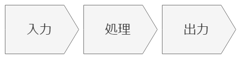
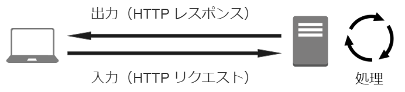
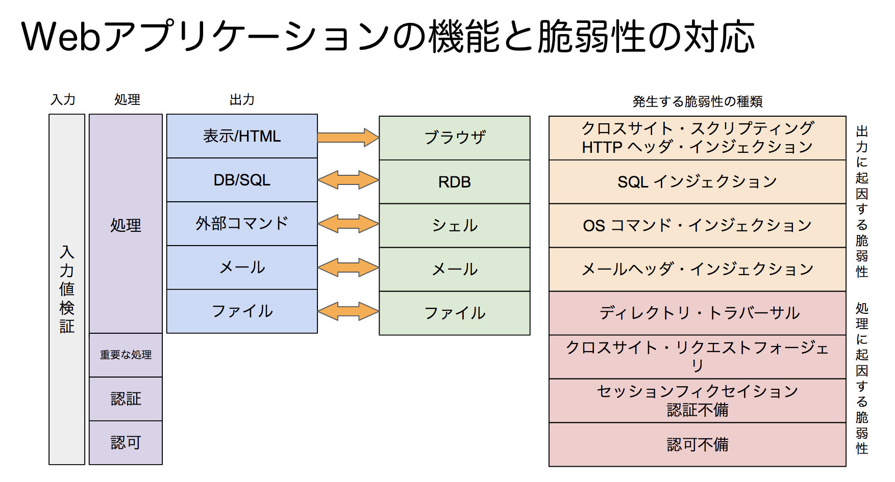
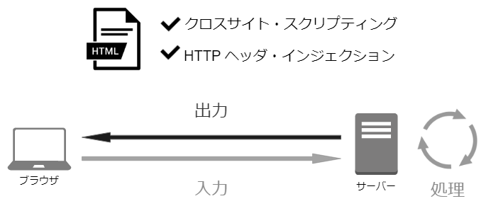
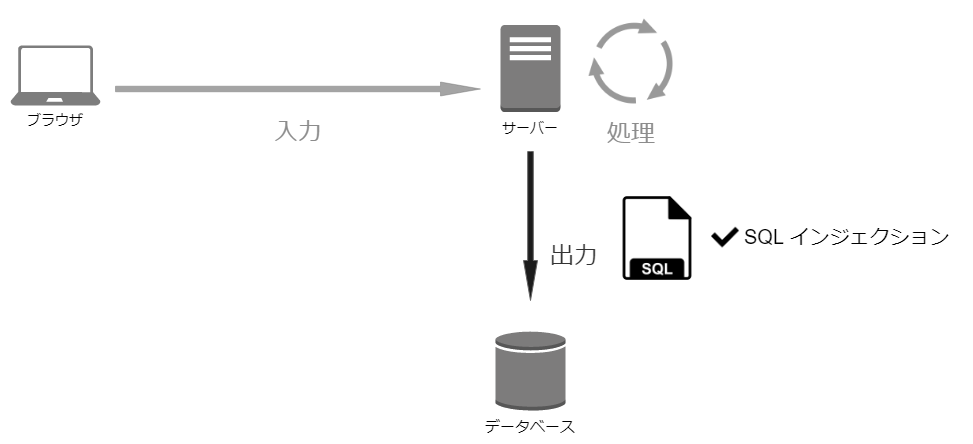
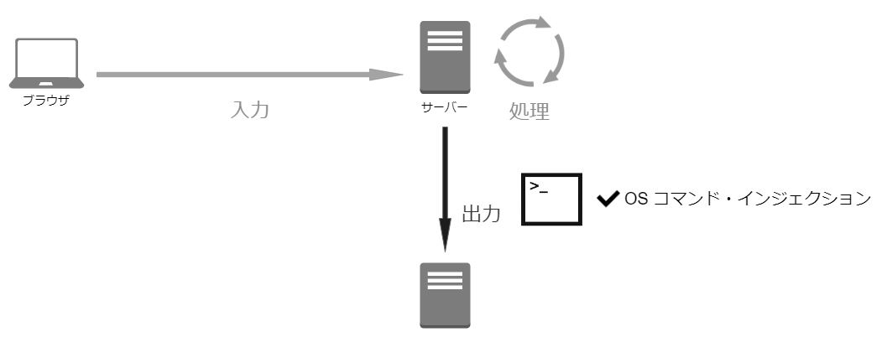
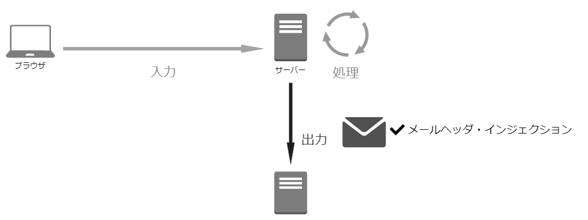

## Webアプリケーションの機能別に見るセキュリティバグ
~Webアプリケーションの機能と脆弱性の対応~

--

### 自己紹介

- 名前：今村昌平
- 職業：システムエンジニア(3年目)
- 脆弱性：花粉、睡眠不足

--

### 本ドキュメントについて

- Weeyble 勉強会のための資料です
- 権利関係で問題がありましたら、ご連絡ください
- reveal.js で作成しています
- スライドは[こちら](https://shoheiimamura.github.io/secure_web_apps_4.1/#/)からアクセスできます。

---

## 脆弱性はどこで発生するのか

--

### 入力-処理-出力モデル

- コンピュータの動作の単純なモデル



--

### 入力-処理-出力モデル（Web）

- Web サーバ
  - 入力：HTTP リクエスト
  - 出力：HTTP レスポンス



--

### Webアプリケーションの機能と脆弱性の対応



--

#### HTML/HTTP ヘッダの出力と脆弱性



--

#### SQL 文の呼び出し（発行）



--

#### シェルコマンドの呼び出し



--

#### メールヘッダ及び本文の出力



---

### インジェクション系脆弱性とは

- 「終端を示すマーク」をデータ内に混入
    - シングルクォート「'」
    - ダブルクォート「”」
    - デリミタ（「,」 タブ  改行）
- 構造の変化による、想定しない動作

--

### 動的な表示を行うパターン

1. テキストの文構造は予め作成する
2. 内部にデータを流し込む領域を用意する
3. リクエストに応じて、データを流し込む

--

### 動的な表示を行うパターン(例)

```sql
# ユーザ ID ($id) をキーとして対象ユーザを取得する構文
SELECT * FROM users WHERE id = '$id';


# ユーザ ID に「10」を指定した場合
SELECT * FROM users WHERE id = '10';


# ユーザ ID に「';DELETE FROM users--」を指定した場合
SELECT * FROM users WHERE id = '';DELETE FROM users --';
```

--

### インジェクション系脆弱性の比較

- クロスサイト・スクリプティング
- HTTPヘッダ・インジェクション
- SQL インジェクション
- OS コマンド・インジェクション

--

#### クロスサイト・スクリプティング

```http
# 検索キーワードを表示する構文
https://example.com/search?keyword=｛検索キーワード｝

# 検索キーワードに「notebook」を指定した場合
https://example.com/search?keyword=notebook

# 検索キーワードに「<script>alert(document.cookie)</script>」を指定した場合
https://example.com/search?keyword=<script>alert(document.cookie)</script>
```

--

#### HTTPヘッダ・インジェクション

```http
# 指定した URL へ遷移する構文
https://example.com/redirect.cgi?url=｛URL｝

# URL に「https://example.com」を指定した場合
https://example.com/redirect.cgi?url=http://example.com

# URL に「https://example.com%0D$D0ALocation:+https://trap.example.com」を指定した場合
https://example.com/redirect.cgi?url=https://example.com%0D$D0ALocation:+https://trap.example.com


# 上記例では、プログラム中に2行のLocationヘッダが出力される
# Location: https://example.com
# Location: https://trap.example.com
```

--

#### SQL インジェクション

```sql
# ユーザ名とパスワードで認証する構文
SELECT * FROM users WHERE id = '$id' and pwd = '$pwd'

# ユーザ名「yamada」パスワード「pass1」で認証する場合
SELECT * FROM users WHERE id = 'yamada' and pwd = 'pass1'

# ユーザ名「yamada」パスワード「' OR 'a' = 'a」で認証する場合
SELECT * FROM users WHERE id = 'yamada' and pwd = '' OR 'a' = 'a'
```

--

#### OS コマンド・インジェクション

```php
// 指定したメールアドレスにメールを送信する
system("/usr/sbin/sendmail -i < template.txt $mail");

// 「text@example.com」をメールアドレスに指定した場合
system("/usr/sbin/sendmail -i < template.ext test@example.com");

// 「text@example.com;cat /etc/passwd」をメールアドレスに指定した場合
system("/usr/sbin/sendmail -i < template.ext text@example.com;cat /etc/passwd");
// 上記の場合、/etc/paswd が表示される
```
